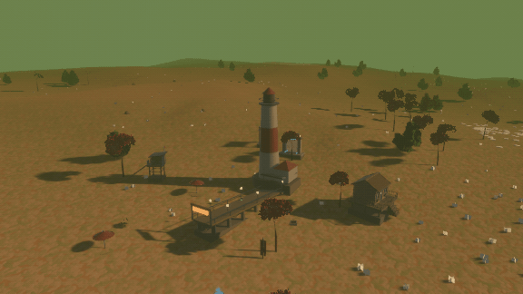
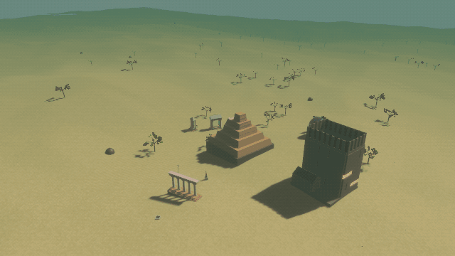
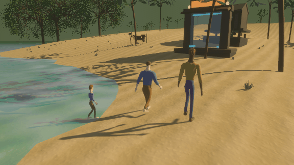
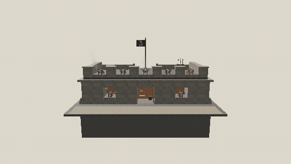

# Symbios Overlands

> A free and open creative virtual world. Build yours, then walk into your friends'.

🌍 **[Enter the Overlands (Live Browser / WASM Demo)](https://thejanusstream.github.io/symbios-overlands)** -
sign in with the Bluesky account you already have.

> 🚧 Prototype in active development



## What you get

The moment you sign in, you have a world. It is yours, it is unlike anyone
else's, and it is already there: its own landscape, weather, settlement and
soundtrack, grown from your identity before you touch a single control.
Reshape the ground, place buildings and trees from a catalogue of hundreds,
sculpt an avatar that is yours across apps, hang your creations on it or gift
them to friends. Then step through a doorway into a friend's world - there is
no server to join and no loading screen between worlds.

## Why it is different

- **It is yours.** Your world and your avatar live in your own account, on
  whichever server hosts that account - not on a game server this project
  runs. They go where your account goes.
- **Nothing to sign up for.** Sign in with your Bluesky account, or any
  account on the same open network. The app never sees your password.
- **Worlds are recipes, not files.** A world is a small set of instructions
  your own computer grows into terrain, streets, buildings, plants and sound.
  That is why there are no world servers to pay for or lose, why a world
  loads in seconds, and why editing one feels like gardening rather than
  uploading.
- **Friends are a doorway away.** Every world grows a gateway. Step into it
  and it shows you the owner's friends' worlds; walk out into one of them.







Every picture on this page was rendered by the project's own headless tool:
the worlds from their seeds, the buildings from the catalogue. Nothing is
hand-modelled - the terrain, the buildings, the plants and the body are all
grown from a recipe.

## Try it

The quickest way is the **[browser demo](https://thejanusstream.github.io/symbios-overlands)**.
Natively:

```bash
cargo run --profile test-release
```

That is the dev loop, and `--release` is deliberately not: this crate's release
profile is tuned for the wasm bundle and carries fat LTO, which costs ~644 s
and ~8 GB of RAM per link against ~5 s and ~1.7 GB for `test-release`. Use
`cargo run --release` when you want the shipping binary.

See [docs/building.md](docs/building.md) for the WebAssembly build, the
landmark-link CLI flags, and the developer tooling - including the render
tool that made the pictures above.

## Under the hood

Sign in with your ATProto identity, walk into a 3D world that belongs to you.
Edit the terrain, scatter buildings, dress your avatar, then step through a
portal into someone else's overland - no loading screen between worlds.
There are no central game servers hosting the worlds; only a small
broker for the WebRTC handshake. Once peers connect, every transform, edit and
chat message flows directly between them.

Built in Rust on the [Bevy](https://bevyengine.org/) engine. The same codebase
runs natively or in any modern browser via WASM.

**Your DID is your domain.** Authenticate via ATProto OAuth - the app never
sees a password. Your world is deterministically seeded from your DID, so a
brand-new user already has a unique homeworld before they touch the editor:
its own landform, biome and settlement theme, its own colour palette, even its
own soundtrack - plus two socio-political dials, prosperity and escalation,
that decide whether that theme reads as a marble forum or a scrap shanty, a
market day or a barricade. Nothing about that roll is final: the editor shows
you what each axis landed on, and you can re-roll the lot, or padlock the axes
you like and let it hunt for a seed that keeps them.

**Worlds are recipes, not assets.** A room is a small set of records on your
own PDS carrying a tree of generators - terrain, water, portals, road networks,
parametric primitives, L-system plants, building grammars, image-bearing signs,
particle emitters. Every widget in the owner-only World Editor mutates the live
recipe in place: the world recompiles around you, remote peers mirror each edit
before you press **Save to PDS**, and nothing is a one-way door - Ctrl+Z walks
back through a labelled history of the last thirty-two edits, in the avatar
editor as well as the world. A whole region - a house, a forest, a market
square - becomes one named generator you can scatter, grid-array, or stash in
your inventory.

**Avatars are recipes too.** Your body is one of two kinds, and either rides
one of five physics presets - `HoverBoat`, `Humanoid`, `Airplane`, `Helicopter`
or `Car`. Vehicles - hover-boats, airships, land-skiffs - are generator trees
built from the same vocabulary the world is. People are parametric skinned
bodies from the `symbios-avatar` engine: a few dozen sculpting axes, no
imported mesh, and every motion computed rather than played back - the walk,
the run, the jump, the swim and the idle all fall out of what the body is
doing. That body lives in a wardrobe on your PDS under a *cross-app* lexicon,
so it is your face in any symbios application, not just this one, and you can
hang up to sixteen props on it - anything from your inventory, pinned to a rig
socket and nudged into place with an in-world gizmo. Visual and locomotion
edits stream to peers as a live preview before you commit them.

**Sound is procedural too.** Audio is a recipe slot, not a shipped asset: the
room carries an ambient-bed slot and every construct can carry its own
synthesised voice, played spatially at its world position. A pop-out
node-graph-and-step-sequencer editor authors patches live, and a fresh room is
already seeded with a layered ambient soundtrack - an atonal biome texture
under a tonal theme voice - plus material-keyed impact sounds before the owner
touches a knob.

**The web is seamless.** Walk through a portal doorway and the engine hot-swaps
the destination world and the peer mesh in the background. Every homeworld also
grows a themed gateway beside its spawn - it is where you land when you log in,
and stepping into it lists the room owner's mutual follows, so you can walk out
of a stranger's world into their friends' worlds without ever typing a DID. A
monument next to the gate carries the owner's profile picture, so you always
know whose ground you are standing on. Shareable landmark links bundle a
destination, position and heading into a URL so anyone with an ATProto account
can drop into a specific spot in someone else's world.

**Contact brings it to life.** Every avatar is classified against the surface
beneath it each frame, and the contact drives a stack of effects: water wakes,
dust bursts, stains baked into the terrain, fading decals, and spatial audio
cues. People gesture, too, with nothing to learn: say hello in chat and your
avatar waves - there is no slash-command vocabulary, just four gestures the
keywords of ordinary conversation reach for.

**Persistence and gifting.** Inventories live on your PDS. Stash a custom-tuned
tree or a whole region blueprint, carry it across the network, and drag it onto
a peer's row in the People panel to gift it. A built-in Catalogue ships a
starter library alongside whatever you've authored: hundreds of architectural
blueprints spanning 24 themes - from ancient villas and medieval keeps to
cyberpunk megatowers, steampunk foundries, buccaneer careening slips and alien
hives. Those same theme tags drive the mini-settlement every fresh homeworld
grows around its spawn.

## Learn more

- [docs/architecture.md](docs/architecture.md) - how it's put together: the
  engine stack, the `symbios` procedural ecosystem, protocol safety, the
  loading gate, compute offload, per-face materials and UV projection, the two
  avatar body kinds, data flow, and the full module map.
- [docs/building.md](docs/building.md) - building & running (native + WASM),
  tests, and the headless render/analysis tooling.
- [docs/diagnostics.md](docs/diagnostics.md) - the session log, the in-game
  diagnostics panel, and the offline analyzer.
- [docs/lsystem-playbook.md](docs/lsystem-playbook.md) - taking a species
  request to a plant grammar: the engine's turtle vocabulary and its traps,
  growth as iteration count, the pipe model, tropism and phyllotaxis, and the
  finalization pass that separates a grammar's logic from its appearance.

## License

[Apache-2.0](LICENSE).
